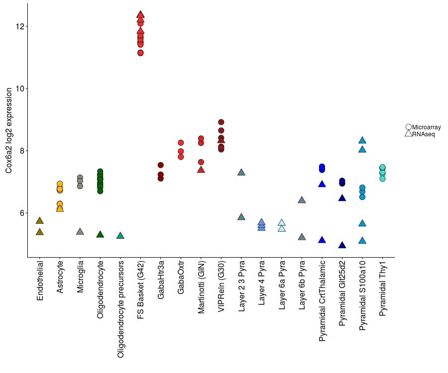
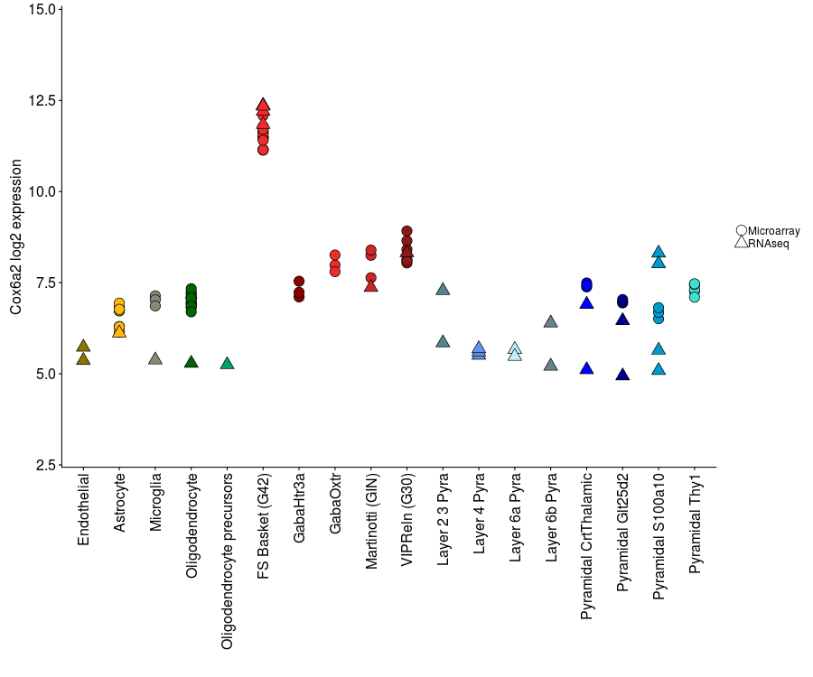
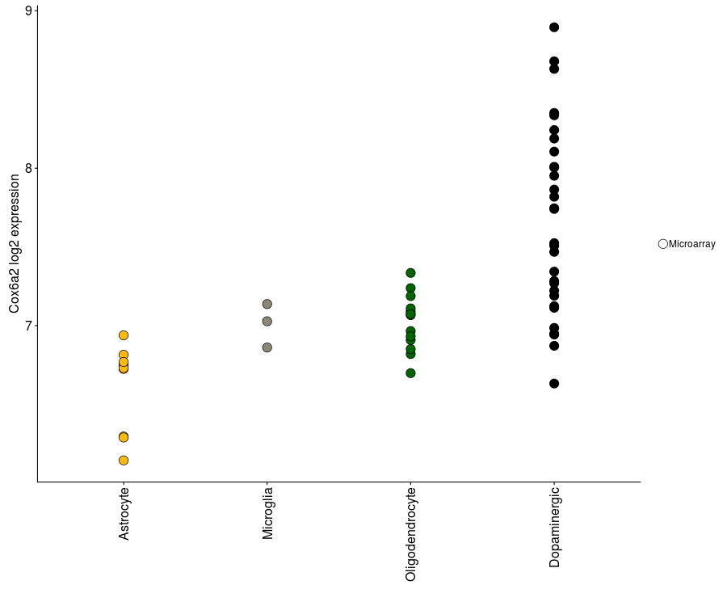

api.neuroexpresso.org
================

Currently the API has two endpoints, `nx_plot` and `nx_data.`. `nx_plot`
returns a png plot while `nx_data` returns a JSON file with the same
content. Both share the following arguments

  - `gene`: Symbol of the requrested gene. Defaults to Ogn
  - `ncbi`: Ncbi ID of the requested gene
  - `ensembl`: Ensembl id of the requested gene

Please provide only one type of gene identifier.

  - `region`: Brain region. If provided, only returns samples from the
    relevant brain region. Possible values are All, Cerebrum, Cortex,
    BasalForebrain, Striatum, Amygdala, Hippocampus, Subependymal,
    Thalamus, Brainstem, Midbrain, SubstantiaNigra, LocusCoeruleus,
    Cerebellum, SpinalCord
  - `dataset`: Which dataset to get the data from. Defaults to `GPL339`.
    Possible values are `GPL339`, `GPL1261` and `RNAseq`. `GPL339` also
    shows the samples from the GPL1261 platform and RNA-seq clusters but
    has less gene coverage. `GPL1261` has more gene coverage and also
    shows samples from RNA-seq clusters. `RNAseq` has the most gene
    coverage but only shows the data from the RNA-seq clusters

The `nx_plot` endpoint has an additional `fixed` variable that is `true`
or `false`. It is `false` by default. If `true` the axis of the returned
plot will be fixed to be able to show the highest and the lowest
expressed genes. Used to create plots that are directly comparable to
each
    other.

## Example queries

    https://api.neuroexpresso.org/nx_plot?gene=Cox6a2&region=Cortex

<!-- -->

    https://api.neuroexpresso.org/nx_plot?gene=Cox6a2&region=Cortex&fixed=true

<!-- -->

    https://api.neuroexpresso.org/nx_plot?ncbi=12862&region=SubstantiaNigra

<!-- -->

    https://api.neuroexpresso.org/nx_data?ncbi=12862&region=SubstantiaNigra

    ## [
    ##   {
    ##     "Sample": "GSM241912",
    ##     "Expression": 6.8149,
    ##     "Cell Type": "Astrocyte",
    ##     "Reference": "Cahoy et al., 2008",
    ##     "PMID": 18171944,
    ##     "Data Source": "Microarray"
    ##   },
    ##   {
    ##     "Sample": "GSM241914",
    ##     "Expression": 6.7251,
    ##     "Cell Type": "Astrocyte",
    ##     "Reference": "Cahoy et al., 2008",
    ##     "PMID": 18171944,
    ##     "Data Source": "Microarray"
    ##   },
    ##   {
    ##     "Sample": "GSM241926",
    ##     "Expression": 6.1443,
    ##     "Cell Type": "Astrocyte",
    ##     "Reference": "Cahoy et al., 2008",
    ##     "PMID": 18171944,
    ##     "Data Source": "Microarray"
    ##   },
    ##   {
    ##     "Sample": "GSM241915",
    ##     "Expression": 6.2961,
    ##     "Cell Type": "Astrocyte",
    ##     "Reference": "Cahoy et al., 2008",
    ##     "PMID": 18171944,
    ##     "Data Source": "Microarray"
    ##   },
    ##   {
    ##     "Sample": "GSM241925",
    ##     "Expression": 6.751,
    ##     "Cell Type": "Astrocyte",
    ##     "Reference": "Cahoy et al., 2008",
    ##     "PMID": 18171944,
    ##     "Data Source": "Microarray"
    ##   },
    ##   {
    ##     "Sample": "GSM866327",
    ##     "Expression": 6.2898,
    ##     "Cell Type": "Astrocyte",
    ##     "Reference": "Zamanian et al 2012",
    ##     "PMID": 22553043,
    ##     "Data Source": "Microarray"
    ##   },
    ##   {
    ##     "Sample": "GSM866328",
    ##     "Expression": 6.9384,
    ##     "Cell Type": "Astrocyte",
    ##     "Reference": "Zamanian et al 2012",
    ##     "PMID": 22553043,
    ##     "Data Source": "Microarray"
    ##   },
    ##   {
    ##     "Sample": "GSM866329",
    ##     "Expression": 6.7312,
    ##     "Cell Type": "Astrocyte",
    ##     "Reference": "Zamanian et al 2012",
    ##     "PMID": 22553043,
    ##     "Data Source": "Microarray"
    ##   },
    ##   {
    ##     "Sample": "GSM866330",
    ##     "Expression": 6.7692,
    ##     "Cell Type": "Astrocyte",
    ##     "Reference": "Zamanian et al 2012",
    ##     "PMID": 22553043,
    ##     "Data Source": "Microarray"
    ##   },
    ##   {
    ##     "Sample": "GSM741193",
    ##     "Expression": 7.1372,
    ##     "Cell Type": "Microglia",
    ##     "Reference": "Anandasabapathy et al., 2011",
    ##     "PMID": 21788405,
    ##     "Data Source": "Microarray"
    ##   },
    ##   {
    ##     "Sample": "GSM741194",
    ##     "Expression": 7.0278,
    ##     "Cell Type": "Microglia",
    ##     "Reference": "Anandasabapathy et al., 2011",
    ##     "PMID": 21788405,
    ##     "Data Source": "Microarray"
    ##   },
    ##   {
    ##     "Sample": "GSM741192",
    ##     "Expression": 6.8612,
    ##     "Cell Type": "Microglia",
    ##     "Reference": "Anandasabapathy et al., 2011",
    ##     "PMID": 21788405,
    ##     "Data Source": "Microarray"
    ##   },
    ##   {
    ##     "Sample": "GSM241890",
    ##     "Expression": 7.0671,
    ##     "Cell Type": "Oligodendrocyte",
    ##     "Reference": "Cahoy et al., 2008",
    ##     "PMID": 18171944,
    ##     "Data Source": "Microarray"
    ##   },
    ##   {
    ##     "Sample": "GSM241893",
    ##     "Expression": 7.2383,
    ##     "Cell Type": "Oligodendrocyte",
    ##     "Reference": "Cahoy et al., 2008",
    ##     "PMID": 18171944,
    ##     "Data Source": "Microarray"
    ##   },
    ##   {
    ##     "Sample": "GSM241894",
    ##     "Expression": 7.09,
    ##     "Cell Type": "Oligodendrocyte",
    ##     "Reference": "Cahoy et al., 2008",
    ##     "PMID": 18171944,
    ##     "Data Source": "Microarray"
    ##   },
    ##   {
    ##     "Sample": "GSM241918",
    ##     "Expression": 6.9089,
    ##     "Cell Type": "Oligodendrocyte",
    ##     "Reference": "Cahoy et al., 2008",
    ##     "PMID": 18171944,
    ##     "Data Source": "Microarray"
    ##   },
    ##   {
    ##     "Sample": "GSM337844",
    ##     "Expression": 6.8197,
    ##     "Cell Type": "Oligodendrocyte",
    ##     "Reference": "Doyle et al., 2008",
    ##     "PMID": 19013282,
    ##     "Data Source": "Microarray"
    ##   },
    ##   {
    ##     "Sample": "GSM337845",
    ##     "Expression": 6.9655,
    ##     "Cell Type": "Oligodendrocyte",
    ##     "Reference": "Doyle et al., 2008",
    ##     "PMID": 19013282,
    ##     "Data Source": "Microarray"
    ##   },
    ##   {
    ##     "Sample": "GSM337846",
    ##     "Expression": 6.9327,
    ##     "Cell Type": "Oligodendrocyte",
    ##     "Reference": "Doyle et al., 2008",
    ##     "PMID": 19013282,
    ##     "Data Source": "Microarray"
    ##   },
    ##   {
    ##     "Sample": "GSM337800",
    ##     "Expression": 7.1096,
    ##     "Cell Type": "Oligodendrocyte",
    ##     "Reference": "Doyle et al., 2008",
    ##     "PMID": 19013282,
    ##     "Data Source": "Microarray"
    ##   },
    ##   {
    ##     "Sample": "GSM337801",
    ##     "Expression": 7.1879,
    ##     "Cell Type": "Oligodendrocyte",
    ##     "Reference": "Doyle et al., 2008",
    ##     "PMID": 19013282,
    ##     "Data Source": "Microarray"
    ##   },
    ##   {
    ##     "Sample": "GSM337802",
    ##     "Expression": 7.3349,
    ##     "Cell Type": "Oligodendrocyte",
    ##     "Reference": "Doyle et al., 2008",
    ##     "PMID": 19013282,
    ##     "Data Source": "Microarray"
    ##   },
    ##   {
    ##     "Sample": "GSM742912",
    ##     "Expression": 7.0736,
    ##     "Cell Type": "Oligodendrocyte",
    ##     "Reference": "Fomchenko et al 2011",
    ##     "PMID": 21754979,
    ##     "Data Source": "Microarray"
    ##   },
    ##   {
    ##     "Sample": "GSM742913",
    ##     "Expression": 6.8512,
    ##     "Cell Type": "Oligodendrocyte",
    ##     "Reference": "Fomchenko et al 2011",
    ##     "PMID": 21754979,
    ##     "Data Source": "Microarray"
    ##   },
    ##   {
    ##     "Sample": "GSM742914",
    ##     "Expression": 6.6985,
    ##     "Cell Type": "Oligodendrocyte",
    ##     "Reference": "Fomchenko et al 2011",
    ##     "PMID": 21754979,
    ##     "Data Source": "Microarray"
    ##   },
    ##   {
    ##     "Sample": "A10_15_Chee_S1_M430A",
    ##     "Expression": 7.4685,
    ##     "Cell Type": "Dopaminergic",
    ##     "Reference": "Chung et al., 2005",
    ##     "PMID": 15888489,
    ##     "Data Source": "Microarray"
    ##   },
    ##   {
    ##     "Sample": "A10_16_Chee_S1_M430A",
    ##     "Expression": 8.351,
    ##     "Cell Type": "Dopaminergic",
    ##     "Reference": "Chung et al., 2005",
    ##     "PMID": 15888489,
    ##     "Data Source": "Microarray"
    ##   },
    ##   {
    ##     "Sample": "A10_8_Chee_S1_M430A",
    ##     "Expression": 8.2426,
    ##     "Cell Type": "Dopaminergic",
    ##     "Reference": "Chung et al., 2005",
    ##     "PMID": 15888489,
    ##     "Data Source": "Microarray"
    ##   },
    ##   {
    ##     "Sample": "A10_3_Chee_S1_M430A",
    ##     "Expression": 7.952,
    ##     "Cell Type": "Dopaminergic",
    ##     "Reference": "Chung et al., 2005",
    ##     "PMID": 15888489,
    ##     "Data Source": "Microarray"
    ##   },
    ##   {
    ##     "Sample": "A10_6_Chee_S1_M430A",
    ##     "Expression": 6.9435,
    ##     "Cell Type": "Dopaminergic",
    ##     "Reference": "Chung et al., 2005",
    ##     "PMID": 15888489,
    ##     "Data Source": "Microarray"
    ##   },
    ##   {
    ##     "Sample": "A10_17_Chee_S1_M430A",
    ##     "Expression": 6.9858,
    ##     "Cell Type": "Dopaminergic",
    ##     "Reference": "Chung et al., 2005",
    ##     "PMID": 15888489,
    ##     "Data Source": "Microarray"
    ##   },
    ##   {
    ##     "Sample": "A10_18_Chee_S1_M430A",
    ##     "Expression": 7.7457,
    ##     "Cell Type": "Dopaminergic",
    ##     "Reference": "Chung et al., 2005",
    ##     "PMID": 15888489,
    ##     "Data Source": "Microarray"
    ##   },
    ##   {
    ##     "Sample": "A10_19_Chee_S1_M430A",
    ##     "Expression": 6.9483,
    ##     "Cell Type": "Dopaminergic",
    ##     "Reference": "Chung et al., 2005",
    ##     "PMID": 15888489,
    ##     "Data Source": "Microarray"
    ##   },
    ##   {
    ##     "Sample": "A10_13_Chee_S1_M430A",
    ##     "Expression": 7.5243,
    ##     "Cell Type": "Dopaminergic",
    ##     "Reference": "Chung et al., 2005",
    ##     "PMID": 15888489,
    ##     "Data Source": "Microarray"
    ##   },
    ##   {
    ##     "Sample": "A10_14_Chee_S1_M430A",
    ##     "Expression": 7.5084,
    ##     "Cell Type": "Dopaminergic",
    ##     "Reference": "Chung et al., 2005",
    ##     "PMID": 15888489,
    ##     "Data Source": "Microarray"
    ##   },
    ##   {
    ##     "Sample": "A10_2_Chee_S1_M430A",
    ##     "Expression": 8.0091,
    ##     "Cell Type": "Dopaminergic",
    ##     "Reference": "Chung et al., 2005",
    ##     "PMID": 15888489,
    ##     "Data Source": "Microarray"
    ##   },
    ##   {
    ##     "Sample": "A10_20_Chee_S1_M430A",
    ##     "Expression": 6.8721,
    ##     "Cell Type": "Dopaminergic",
    ##     "Reference": "Chung et al., 2005",
    ##     "PMID": 15888489,
    ##     "Data Source": "Microarray"
    ##   },
    ##   {
    ##     "Sample": "A10_7_Chee_S1_M430A",
    ##     "Expression": 8.3359,
    ##     "Cell Type": "Dopaminergic",
    ##     "Reference": "Chung et al., 2005",
    ##     "PMID": 15888489,
    ##     "Data Source": "Microarray"
    ##   },
    ##   {
    ##     "Sample": "A9_13_Chee_S1_M430A",
    ##     "Expression": 8.0053,
    ##     "Cell Type": "Dopaminergic",
    ##     "Reference": "Chung et al., 2005",
    ##     "PMID": 15888489,
    ##     "Data Source": "Microarray"
    ##   },
    ##   {
    ##     "Sample": "A9_15_Chee_S1_M430A",
    ##     "Expression": 8.1882,
    ##     "Cell Type": "Dopaminergic",
    ##     "Reference": "Chung et al., 2005",
    ##     "PMID": 15888489,
    ##     "Data Source": "Microarray"
    ##   },
    ##   {
    ##     "Sample": "A9_8_Chee_S1_M430A",
    ##     "Expression": 8.6791,
    ##     "Cell Type": "Dopaminergic",
    ##     "Reference": "Chung et al., 2005",
    ##     "PMID": 15888489,
    ##     "Data Source": "Microarray"
    ##   },
    ##   {
    ##     "Sample": "A9_17_Chee_S1_M430A",
    ##     "Expression": 7.3433,
    ##     "Cell Type": "Dopaminergic",
    ##     "Reference": "Chung et al., 2005",
    ##     "PMID": 15888489,
    ##     "Data Source": "Microarray"
    ##   },
    ##   {
    ##     "Sample": "A9_14_Chee_S1_M430A",
    ##     "Expression": 8.1054,
    ##     "Cell Type": "Dopaminergic",
    ##     "Reference": "Chung et al., 2005",
    ##     "PMID": 15888489,
    ##     "Data Source": "Microarray"
    ##   },
    ##   {
    ##     "Sample": "A9_16_Chee_S1_M430A",
    ##     "Expression": 7.8643,
    ##     "Cell Type": "Dopaminergic",
    ##     "Reference": "Chung et al., 2005",
    ##     "PMID": 15888489,
    ##     "Data Source": "Microarray"
    ##   },
    ##   {
    ##     "Sample": "A9_18_Chee_S1_M430A",
    ##     "Expression": 7.2695,
    ##     "Cell Type": "Dopaminergic",
    ##     "Reference": "Chung et al., 2005",
    ##     "PMID": 15888489,
    ##     "Data Source": "Microarray"
    ##   },
    ##   {
    ##     "Sample": "A9_19_Chee_S1_M430A",
    ##     "Expression": 7.1239,
    ##     "Cell Type": "Dopaminergic",
    ##     "Reference": "Chung et al., 2005",
    ##     "PMID": 15888489,
    ##     "Data Source": "Microarray"
    ##   },
    ##   {
    ##     "Sample": "A9_20_Chee_S1_M430A",
    ##     "Expression": 7.19,
    ##     "Cell Type": "Dopaminergic",
    ##     "Reference": "Chung et al., 2005",
    ##     "PMID": 15888489,
    ##     "Data Source": "Microarray"
    ##   },
    ##   {
    ##     "Sample": "A9_6_Chee_S1_M430A",
    ##     "Expression": 8.6308,
    ##     "Cell Type": "Dopaminergic",
    ##     "Reference": "Chung et al., 2005",
    ##     "PMID": 15888489,
    ##     "Data Source": "Microarray"
    ##   },
    ##   {
    ##     "Sample": "A9_7_Chee_S1_M430A",
    ##     "Expression": 8.8951,
    ##     "Cell Type": "Dopaminergic",
    ##     "Reference": "Chung et al., 2005",
    ##     "PMID": 15888489,
    ##     "Data Source": "Microarray"
    ##   },
    ##   {
    ##     "Sample": "GSM437382",
    ##     "Expression": 6.6325,
    ##     "Cell Type": "Dopaminergic",
    ##     "Reference": "Phani et al. 2015",
    ##     "PMID": 20462502,
    ##     "Data Source": "Microarray"
    ##   },
    ##   {
    ##     "Sample": "GSM437383",
    ##     "Expression": 7.2223,
    ##     "Cell Type": "Dopaminergic",
    ##     "Reference": "Phani et al. 2015",
    ##     "PMID": 20462502,
    ##     "Data Source": "Microarray"
    ##   },
    ##   {
    ##     "Sample": "GSM437384",
    ##     "Expression": 7.1135,
    ##     "Cell Type": "Dopaminergic",
    ##     "Reference": "Phani et al. 2015",
    ##     "PMID": 20462502,
    ##     "Data Source": "Microarray"
    ##   },
    ##   {
    ##     "Sample": "GSM437391",
    ##     "Expression": 7.8187,
    ##     "Cell Type": "Dopaminergic",
    ##     "Reference": "Phani et al. 2015",
    ##     "PMID": 20462502,
    ##     "Data Source": "Microarray"
    ##   },
    ##   {
    ##     "Sample": "GSM437392",
    ##     "Expression": 7.2838,
    ##     "Cell Type": "Dopaminergic",
    ##     "Reference": "Phani et al. 2015",
    ##     "PMID": 20462502,
    ##     "Data Source": "Microarray"
    ##   },
    ##   {
    ##     "Sample": "GSM437393",
    ##     "Expression": 7.7412,
    ##     "Cell Type": "Dopaminergic",
    ##     "Reference": "Phani et al. 2015",
    ##     "PMID": 20462502,
    ##     "Data Source": "Microarray"
    ##   }
    ## ]
